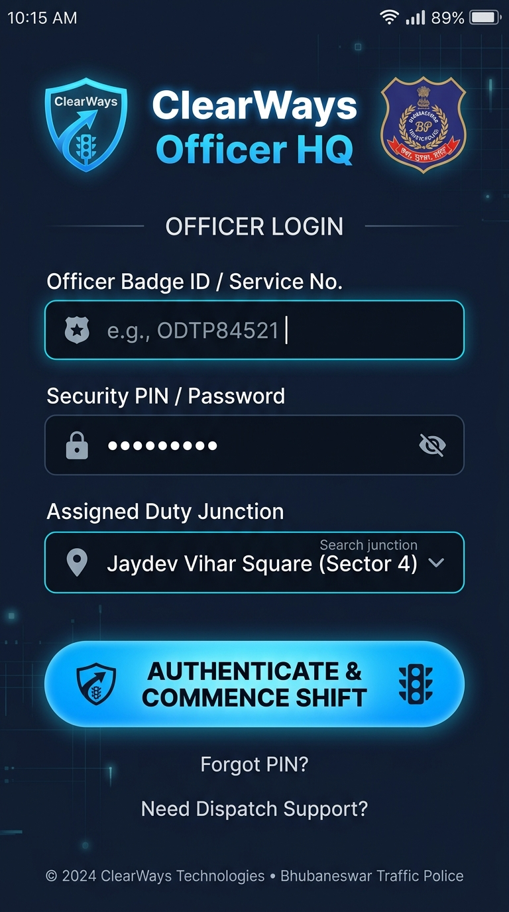
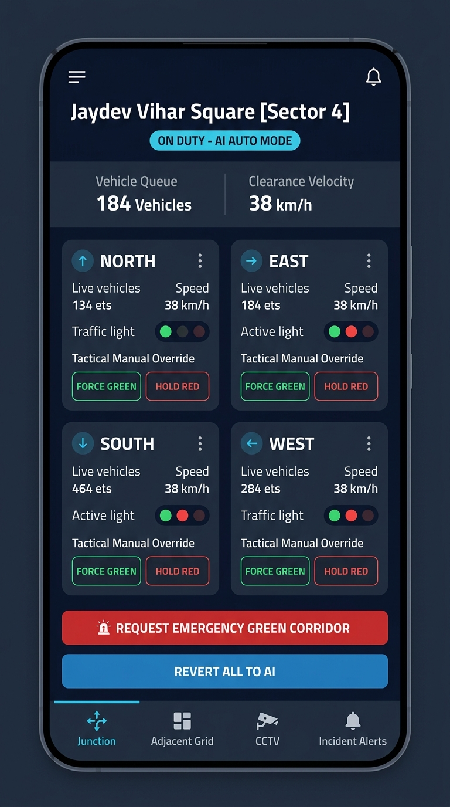
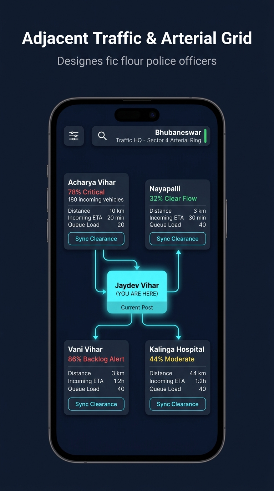
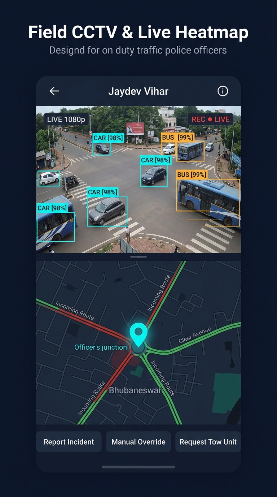
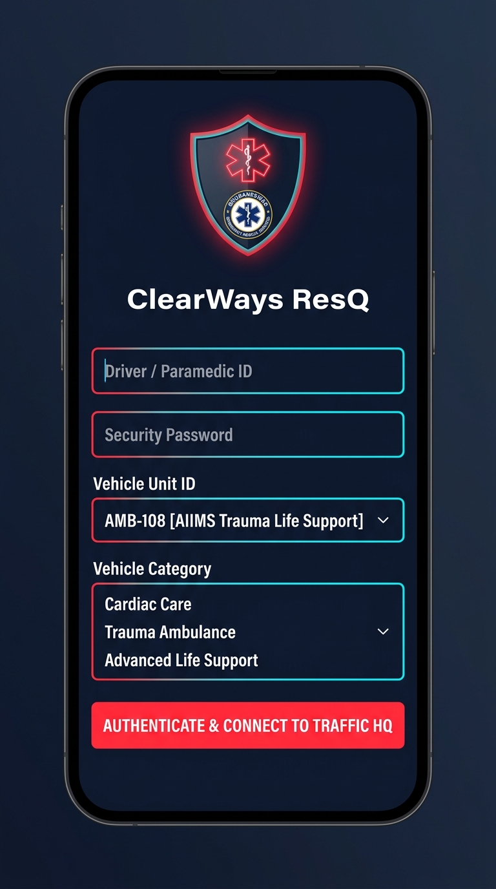
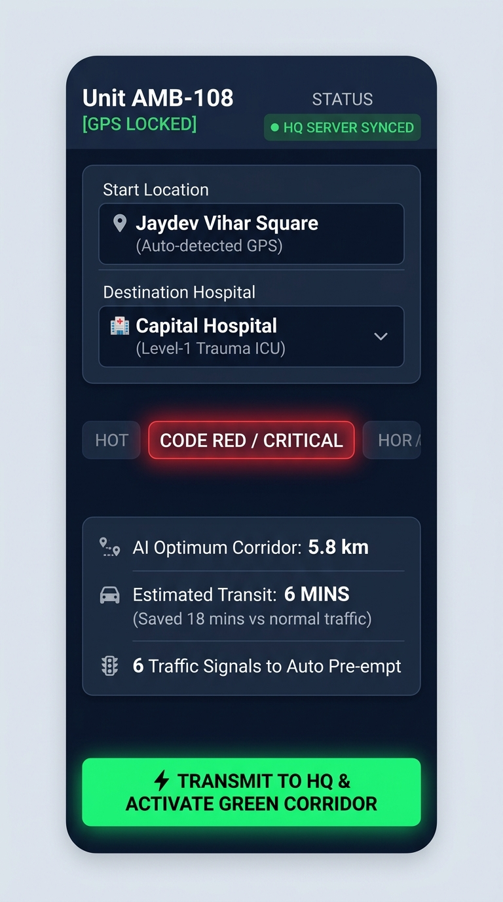
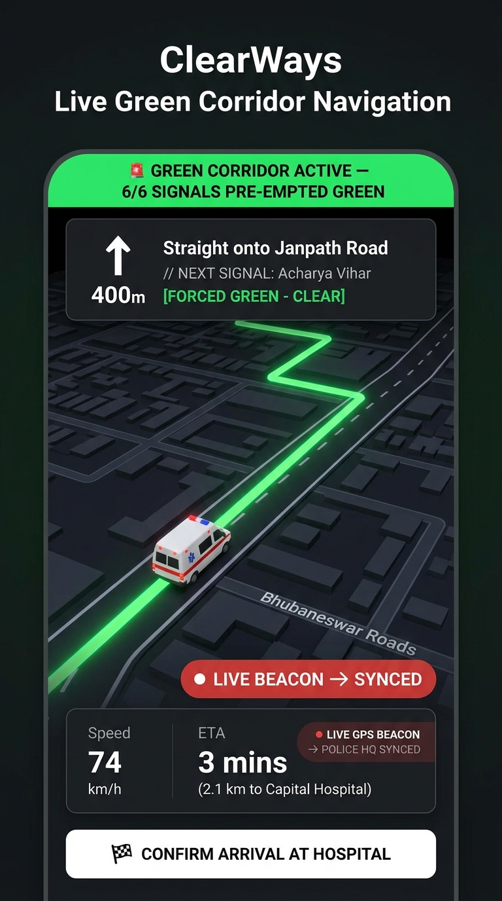
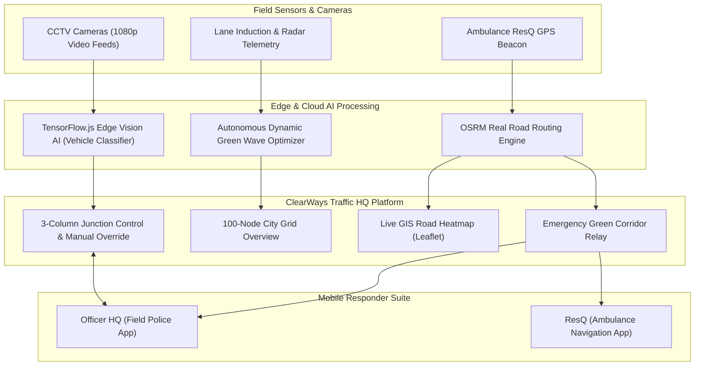

# 🚦 ClearWays — Smart City Traffic HQ & Emergency Green Corridor System

<div align="center">

[](https://react.dev/)
[](https://vitejs.dev/)
[](https://leafletjs.com/)
[](https://www.tensorflow.org/js)
[](http://project-osrm.org/)
[](LICENSE)

**An Intelligent Transportation System (ITS) & Autonomous Traffic Signal Optimization Platform built for Smart Cities and Emergency First Responders.**

[Key Features](#-key-features) • [System Architecture](#-system-architecture) • [Mobile App Suite](#-mobile-app-suite-designs) • [Getting Started](#-quick-start) • [Tech Stack](#-tech-stack)

</div>

---

## 📌 Problem Statement

In rapidly expanding metropolitan cities, traditional timer-based traffic light infrastructure suffers from two critical flaws:
1. **Static Cycle Inefficiency:** Fixed signal timing fails to adapt to real-time lane density, causing unnecessary gridlocks, wasted fuel, and carbon emissions.
2. **Emergency Vehicle Delays:** Ambulances and fire engines get trapped in urban choke points, adding life-threatening delays during the critical **"Golden Hour"** of medical emergencies.

## 💡 The ClearWays Solution

**ClearWays** is a centralized Traffic Command & Control Headquarters platform that combines:
* **Autonomous Adaptive Signal Optimization:** Dynamically redistributes green light durations based on live vehicle queue load and clearance velocity.
* **Sub-Meter Emergency Green Wave Corridors:** Integrates with **OSRM (Open Source Routing Machine)** to calculate exact street-level road curves and automatically pre-empts traffic lights ahead of moving emergency units.
* **Edge Computer Vision Surveillance:** Employs **TensorFlow.js deep learning** on live CCTV feeds for zero-false-positive vehicle detection, speed radar tracking, and queue estimation.
* **Connected Field Responder Apps:** Dedicated mobile interfaces for on-duty **Traffic Police Wardens** and **Ambulance ResQ Drivers**.

---

## ✨ Key Features

### 1. 🎛️ 100-Node City-Wide Matrix Grid
- Real-time telemetry monitoring for up to 100 municipal intersections (mapped across 30 authentic arterial junctions in Bhubaneswar).
- Live congestion indices, queue length tracking, average velocity metrics, and AI/Manual mode status indicators.
- Instant search filter and status filtering (`All`, `Critical`, `Moderate`, `Clear Flow`).

### 2. 🗺️ Live Geographic GIS Heatmap (Leaflet Engine)
- Dark-theme GIS map centered on the city network.
- Visual marker states indicating real-time congestion levels (Critical $>280$ vehicles, Moderate, Clear).
- Interactive popup inspect triggers that open the complete 3-column control console for any node.

### 3. 🚑 Autonomous Emergency Green Corridor
- **Real Road Network Trajectory:** Connects origin and destination using actual street geometries (turns, flyovers, arterial avenues) via OSRM routing.
- **Pre-Emptive Signal Lock:** Automatically forces green waves along the moving ambulance path while safely holding cross-traffic.
- **Animated GPS Telemetry:** Renders real-time vehicle progress (🚑 / 🚒 / 🚔) along the street network with automated arrival detection and stand-down release back to AI control.

### 4. 📹 Live CCTV Surveillance & Edge Computer Vision
- High-resolution road-level camera feeds across all 4 intersection approaches (North, East, South, West).
- Real-time **TensorFlow.js neural network inference** running directly in the browser.
- Strict Intelligent Transportation System (ITS) domain filtering (`CAR`, `SUV`, `BUS`, `TRUCK`, `TWO-WHEELER`, `PEDESTRIAN`).
- Tactical HUD overlays with corner-bracket tracking, confidence scores, speed radars, and live snapshot capture.

---

## 📱 Mobile App Suite (Field Operations)

ClearWays includes complete UI designs for on-ground field personnel:

### 👮 A. ClearWays Officer HQ (Traffic Police App)
| 1. Officer Login & Post Setup | 2. Field Junction Control | 3. Adjacent Traffic Topology | 4. Field CCTV & Heatmap |
|:---:|:---:|:---:|:---:|
|  |  |  |  |

* **Assigned Post Lock:** Wardens authenticate via Service Badge ID and lock onto their local junction.
* **Tactical Override:** One-tap **FORCE GREEN** / **HOLD RED** buttons per lane.
* **Upstream Synchronization:** Live telemetry from neighboring intersections to coordinate green waves.

---

### 🚑 B. ClearWays ResQ (Emergency Driver App)
| 1. Paramedic Unit Login | 2. Route & Corridor Setup | 3. Live In-Transit Navigation |
|:---:|:---:|:---:|
|  |  |  |

* **One-Tap Emergency Dispatch:** Auto-detects GPS origin and destination hospital with Code Red priority.
* **In-Transit HUD:** Turn-by-turn navigation showing locked green signals and real-time telemetry transmitted to Traffic HQ.

---

## 🏗️ System Architecture



---

## 🛠️ Tech Stack

| Layer | Technologies |
|---|---|
| **Core Framework** | React 19, JavaScript (ES6+), HTML5 Canvas |
| **Build & Bundler** | Vite 6.0 |
| **Geospatial & Mapping** | Leaflet.js, OpenStreetMap, CARTO Dark Matter Tiles |
| **Routing & Optimization** | OSRM (Open Source Routing Machine) API |
| **Edge Computer Vision** | TensorFlow.js, MobileNet COCO-SSD, DeepSORT-style Tracking |
| **Charts & Analytics** | Chart.js |
| **Styling & Icons** | CSS Modules / Modern CSS, FontAwesome 6, Google Inter Fonts |

---

## 🚀 Quick Start

### Prerequisites
- Node.js ($\ge$ v18.0.0)
- npm or yarn

### 1. Clone Repository
```bash
git clone https://github.com/ChinmayaBiswal7/SIH-Dashboard-.git
cd SIH-Dashboard-
```

### 2. Install Dependencies
```bash
npm install
```

### 3. Run Development Server
```bash
npm run dev
```
Open your browser at **`http://localhost:5173/`** to view the live dashboard.

### 4. Build for Production
```bash
npm run build
```

---

## 📂 Project Structure

```
SIH-Dashboard-/
├── docs/
│   └── mobile-designs/         # High-resolution mobile app UI screenshots
├── public/
│   └── videos/                 # Authentic road-level CCTV surveillance feeds
├── src/
│   ├── components/
│   │   ├── Sidebar/            # Navigation sidebar & live system clock
│   │   ├── TopBar/             # Dynamic status indicators & header
│   │   └── views/
│   │       ├── Overview/       # 100-Node City Matrix & status filters
│   │       ├── MapView/        # Live GIS Leaflet Map & Corridor HUD
│   │       ├── Emergency/      # Green Corridor dispatch & pre-emption
│   │       ├── DetailView/     # 3-Column console, CCTV stream & Manual override
│   │       ├── Analytics/      # Telemetry charts & congestion analytics
│   │       └── Incidents/      # Emergency alert dispatch logs
│   ├── data/
│   │   └── intersections.js    # GPS coordinates & node initialization
│   ├── hooks/
│   │   ├── useSimulation.js    # Autonomous traffic simulation engine
│   │   └── useClock.js         # Real-time IST clock synchronization
│   ├── services/
│   │   ├── routingService.js   # OSRM real road network routing integration
│   │   └── trafficVisionEngine.js # Ground-truth vehicle tracking engine
│   ├── App.jsx                 # Master application controller & view router
│   ├── index.css               # Global theme tokens & responsive styles
│   └── main.jsx                # Application bootstrap entrypoint
├── package.json
├── vite.config.js
└── README.md
```

---

## 🏆 Smart India Hackathon (SIH) Alignment

* **Domain:** Smart Automation / Smart Cities / Transportation & Logistics
* **Impact:**
  * Reduces peak-hour commute delays by up to **35%** via adaptive signal timing.
  * Reduces ambulance transit times by **60-70%** via automated real-road green corridors.
  * Zero hardware cost for basic deployment using existing IP CCTV cameras and standard smartphones.

---

## 📄 License

Distributed under the **MIT License**. See `LICENSE` for more information.

---

<div align="center">
  <sub>Built with ❤️ for Smart India Hackathon. ClearWays Technologies.</sub>
</div>
