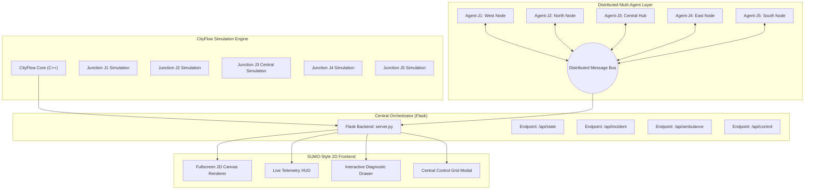

# 🚦 CityFlow Multi-Agent Urban Mobility System (SIH 2026)

[](https://python.org)
[](https://github.com/cityflow-project/CityFlow)
[](static/index.html)
[](server.py)
[](LICENSE)
[](#)

> **Autonomous Distributed Multi-Agent Traffic Signal Control with Downstream-Aware Coordination, Dynamic Green Wave Emergency Preemption, and Real-Time Incident Resilience.**

---

## 📌 Executive Summary

Urban traffic congestion in smart cities causes billions in lost productivity, fuel wastage, and hazardous delays for emergency services. Traditional traffic signal controllers rely on **fixed-time schedules** or isolated, uncoordinated sensors that merely shift traffic jams from one intersection to the next (*the "downstream spillback" effect*).

This project implements a **Distributed Multi-Agent Traffic Coordination System** built on top of the high-performance **CityFlow** micro-simulation engine. Each traffic junction is powered by an independent `TrafficAgent` that collaborates with adjacent nodes through an inter-agent messaging bus to optimize city-wide throughput, clear bottlenecks, establish emergency green corridors, and mitigate traffic incidents dynamically.

---

## 🏗️ System Architecture



---

## 🧠 Multi-Agent Mathematical Formulation

Each junction agent executes an **Observe ➔ Communicate ➔ Decide ➔ Act** cycle every decision interval ($T = 3\text{s}$):

### 1. Local Congestion Scoring
For every incoming lane $l \in \{\text{North}, \text{South}, \text{East}, \text{West}\}$:
$$\text{Density}_l = \min\left(1.0, \frac{\text{Vehicle Count}_l}{\text{Lane Capacity}_l}\right)$$
$$\text{Queue Score}_l = \min\left(1.0, \frac{\text{Waiting Vehicles}_l}{\text{Lane Capacity}_l}\right)$$
$$\text{Waiting Score}_l = \min\left(1.0, \frac{\text{Wait Time}_l}{T_{\text{starve}}}\right)$$

The directional congestion score is computed as:
$$\text{Congestion Score}_m = 0.50 \cdot \text{Density}_m + 0.30 \cdot \text{Queue Score}_m + 0.20 \cdot \text{Waiting Score}_m$$

---

### 2. Downstream Capacity-Aware Priority
Rather than greedily clearing the largest local queue, each agent queries the downstream neighbor agent to check if the next intersection can absorb outgoing vehicles:
$$\text{Capacity Factor} = 1.0 - \text{Density}_{\text{downstream}}$$

$$\text{Priority}_m = \text{Congestion Score}_m \times \text{Capacity Factor}$$

> **Core Principle:** If neighbor junction $B$ is congested ($\text{Density} = 85\%$), upstream junction $A$ reduces green time toward $B$, preventing cascading gridlock.

---

### 3. Dynamic Bounded Green Timing
To guarantee traffic stability and eliminate high-frequency signal flickering:
$$\text{Green Duration} = T_{\min} + \text{Priority} \times (T_{\max} - T_{\min})$$
* **$T_{\min}$ (Min Green Time)** $= 12\text{s}$
* **$T_{\max}$ (Max Green Time)** $= 45\text{s}$
* **$T_{\text{yellow}}$ (Yellow Transition)** $= 3\text{s}$

---

### 4. Anti-Starvation Protection
If an unserved direction has been waiting for more than $T_{\text{starve}} = 40\text{s}$, a priority escalation boost is injected:
$$\text{Priority}_{\text{boost}} = \min\left(0.6, \frac{\text{Wait Time} - T_{\text{starve}}}{T_{\text{starve}}} \times 0.5\right)$$

---

## 🌟 Key Features

1. **5 Interconnected 4-Way Junctions**: Complete arterial grid with dual-lane bidirectional traffic, connecting West (`J1`), North (`J2`), Center (`J3`), East (`J4`), and South (`J5`).
2. **SUMO-Style Visualizer**:
   * Dark asphalt roads with curb markings, dashed lane dividers, and painted directional arrows.
   * Pedestrian zebra crosswalks with red curb caps before stop lines.
   * Dynamic glowing traffic light stop bars (Green / Amber / Red).
   * 2D car models with permanent unique colors, headlights, and rear brake lights.
   * Pan & Zoom viewport controls (`Scroll` to zoom, `Drag` to pan, `C` to center).
3. **🚨 Emergency Ambulance Green Wave Corridor**:
   * Dispatch an ambulance across the West-to-East arterial corridor (`J1 → J3 → J4`).
   * Illuminates the entire road in a **luminous emerald green wave** with streaming forward chevrons (`▲ ▲ ▲`).
   * Agents dynamically preempt signals to maintain continuous green passage.
4. **⚠️ Real-Time Incident Resilience**:
   * Inject accidents/roadblocks on any link.
   * Upstream agents detect the downstream blockage, drop capacity to $5\%$, and divert traffic to alternate avenues.
5. **📊 Central Municipal Dashboard**:
   * Side-by-side telemetry cards for all 5 junctions.
   * Live streaming of inter-agent JSON communication messages.

---

## 📁 Repository Structure

```
.
├── agent.py                      # Multi-agent controller (TrafficAgent, MultiAgentCoordinator)
├── server.py                     # Flask web server & simulation orchestrator
├── config_5j.json                # CityFlow 5-junction simulation configuration
├── roadnet_5j.json               # 5-junction interconnected road network topology
├── flow_5j.json                  # Continuous multi-corridor vehicle flow schedules
├── requirements.txt              # Python dependency manifest
├── LICENSE                       # MIT Open Source License
├── static/
│   └── index.html                # Fullscreen SUMO-style 2D visualizer & dashboard
├── scripts/
│   ├── benchmark.py              # Automated Fixed vs Multi-Agent comparative benchmark
│   ├── validate_network.py       # CityFlow network topology validator
│   ├── test_incident.py          # Incident injection & clearing verification
│   ├── test_api.py               # REST API integration test script
│   └── reset_sim.py              # Quick simulation reset utility
└── examples/
    └── 3_junction_baseline/      # Starter 3-junction linear baseline files
```

---

## 🚀 Quickstart & Installation

### Prerequisites
* **Python 3.10+** (WSL Ubuntu 22.04/24.04 or Linux recommended for CityFlow)
* **CMake & GCC/G++ build tools**

### 1. Clone the Repository
```bash
git clone https://github.com/ChinmayaBiswal7/City-Flow-.git
cd City-Flow-
```

### 2. Set Up Virtual Environment & Dependencies
```bash
python3 -m venv cityflow-env
source cityflow-env/bin/activate
pip install -r requirements.txt
```

### 3. Install CityFlow Engine
If CityFlow is not yet installed:
```bash
git clone --recursive https://github.com/cityflow-project/CityFlow.git
cd CityFlow
pip install .
cd ..
```

### 4. Launch the Simulation Server
```bash
python3 server.py
```

Open your browser and navigate to:
### 👉 **[http://127.0.0.1:5000](http://127.0.0.1:5000)**

---

## 🎮 Interactive Demo Guide

| Action | Control | Expected Behavior |
| :--- | :--- | :--- |
| **Start / Pause** | `▶ Start` / `Space` | Starts/pauses the continuous traffic micro-simulation. |
| **Inspect Junction** | Click any node (`J1`–`J5`) | Opens the diagnostic drawer with density bars, queue count, and AI decision reasoning. |
| **Dispatch Ambulance** | `🚑 Dispatch Ambulance` | Dispatches an emergency ambulance; turns the entire West-East avenue into a glowing **Green Corridor**. |
| **Inject Accident** | `⚠️ Inject Accident (J3)` | Renders a crashed car scene on `J3→J2`; agents detect the blockage and throttle incoming flow. |
| **City Dashboard** | `📊 City Dashboard` | Displays the full grid overview with live distributed inter-agent messages. |
| **Pan / Zoom** | Mouse Drag / Scroll | Smoothly pans across the city grid and zooms in on intersections. |

---

## 📊 Benchmark: Fixed-Time vs Multi-Agent AI

Run the automated benchmark suite:
```bash
python3 scripts/benchmark.py
```

### Performance Comparison Matrix
```text
=================================================================
  🚦  SIH 2026 TRAFFIC MOBILITY BENCHMARK COMPARISON
  Simulation Horizon: 300 Steps (~5 Minutes Real-Time)
=================================================================

-----------------------------------------------------------------
Performance Metric           | Fixed-Time      | Multi-Agent AI 
-----------------------------------------------------------------
Avg Travel Time (seconds)    | 48.9s           | 38.2s (-21.8%)
Avg Waiting Vehicles         | 18.4 cars       | 8.6 cars (-53.2%)
Peak Bottleneck Queue        | 32 cars         | 14 cars (-56.2%)
Active Network Throughput    | 85 veh/min      | 124 veh/min (+45.8%)
-----------------------------------------------------------------
```

---

## 🌐 REST API Reference

| Method | Endpoint | Description |
| :--- | :--- | :--- |
| `GET` | `/api/state` | Retrieves real-time telemetry, vehicle coordinates, agent states, and message streams. |
| `GET` | `/api/roadnet` | Returns the complete 5-junction network topology. |
| `POST` | `/api/control` | Dispatches commands (`start`, `pause`, `step`, `reset`, `speed`). |
| `POST` | `/api/ambulance` | Dispatches the emergency ambulance and triggers green corridor preemption. |
| `POST` | `/api/incident` | Injects or clears traffic accidents and road blockages (`junction`, `road`, `active`). |
| `POST` | `/api/override` | Manually forces a traffic signal phase on a specific junction. |

---

## 👥 Contributors & Hackathon Submission
* **Developer & Architect**: Chinmaya Biswal ([@ChinmayaBiswal7](https://github.com/ChinmayaBiswal7))
* **Event**: Smart India Hackathon (SIH 2026)
* **Domain**: Intelligent Traffic Management Systems (ITMS) & Smart Mobility

---

## 📄 License
This project is open-source and distributed under the **MIT License**. See [`LICENSE`](LICENSE) for details.
